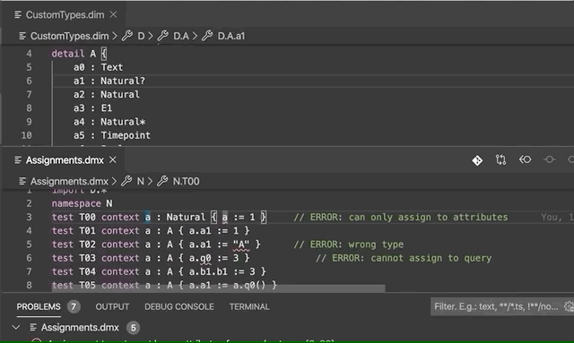

# VS Code Extension

This module provides a **language extension** for Visual Code Studio. It currently supports the following languages:
* Domain Model Expression (`.dmx` files)
* Domain Information Model (`.dim` files)

## Features

The extension provides basic editor support, including 
* keyword highlighting
* cross-reference validation
* bracket matching

and many other features you'd expect from a modern text editor.



## Requirements

Validation and cross-reference navigation requires a **language server** to be running.

## Developer Guide
Build the extension using the following command:
```
npm install && npm run compile
```

The extension may now be published using `vsce` (Visual Studio Code Extension), a command-line tool for packaging, publishing and managing VS Code extensions. If not yet installed, run
```
npm install -g vsce
```
to globally install the tool.

From the extension directory, run
```
vsce package
```
to build a `vsix` file. This file may be installed on the local machine using the following command:
```
code --install-extension my-extension.vsix
```
On macOS, the extension is the added to the `$HOME/.vscode/extensions/` directory. Uninstall the extension using the command `code --uninstall-extension my-extension.vsix` command.

## Known Issues

* [ ] the extension sends a JSON-RPC `shutdown` command
 
## Release Notes

