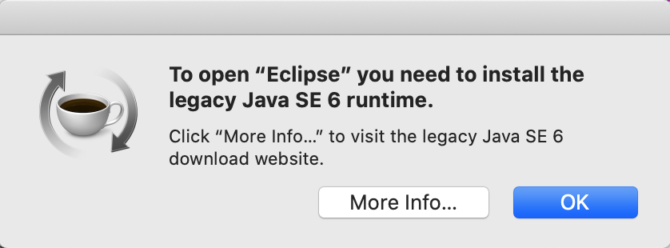

## DDD Repository
This module defines an _Eclipse Product_, used both for building
* an Eclipse P2 Update Site
* a ready to use Eclipse distribution

For this to work, the packaging type is sest to `eclipse-repository`.

The standalone application contains all of the following DDD features:
* `com.mimacom.ddd.dm.base.feature`
* `com.mimacom.ddd.dm.dem.feature`
* `com.mimacom.ddd.dm.dim.feature`
* `com.mimacom.ddd.dm.dmx.feature`
* `com.mimacom.ddd.dm.dom.feature`
* `com.mimacom.ddd.dm.esm.feature`
* `com.mimacom.ddd.sm.asm.feature`
* `com.mimacom.ddd.sm.sim.feature`
* `com.mimacom.ddd.sm.sus.feature`
* `com.mimacom.ddd.util.feature`

### Building the product
Execute the following Maven command:
```
mvn clean package -pl :com.mimacom.ddd.repository
```

The following log statements should be logged:
```
[INFO]
[INFO] --- tycho-p2-director-plugin:1.5.1:archive-products (create-product-distributions) @ com.mimacom.ddd.repository ---
[INFO] Building zip: /.../releng/com.mimacom.ddd.repository/target/products/com.mimacom.ddd.product-macosx.cocoa.x86_64.zip
[INFO] Building zip: /.../releng/com.mimacom.ddd.repository/target/products/com.mimacom.ddd.product-win32.win32.x86_64.zip
[INFO] Building zip: /.../releng/com.mimacom.ddd.repository/target/products/com.mimacom.ddd.product-linux.gtk.x86_64.zip
[INFO] ------------------------------------------------------------------------
[INFO] BUILD SUCCESS
[INFO] ------------------------------------------------------------------------
[INFO] Total time:  01:08 min
[INFO] Finished at: 2019-12-04T10:52:02+01:00
[INFO] ------------------------------------------------------------------------
```

### Troubleshooting

**Problem:** Starting the application on macOS fails with an error:
> To open “Eclipse” you need to install the legacy Java SE 6 runtime



**Solution:**
Add a specific Java runtime present on your machine to the `Eclipse.ini` file:
```-vm
/Library/Java/JavaVirtualMachines/jdk1.8.0_202.jdk/Contents/Home/bin
```
